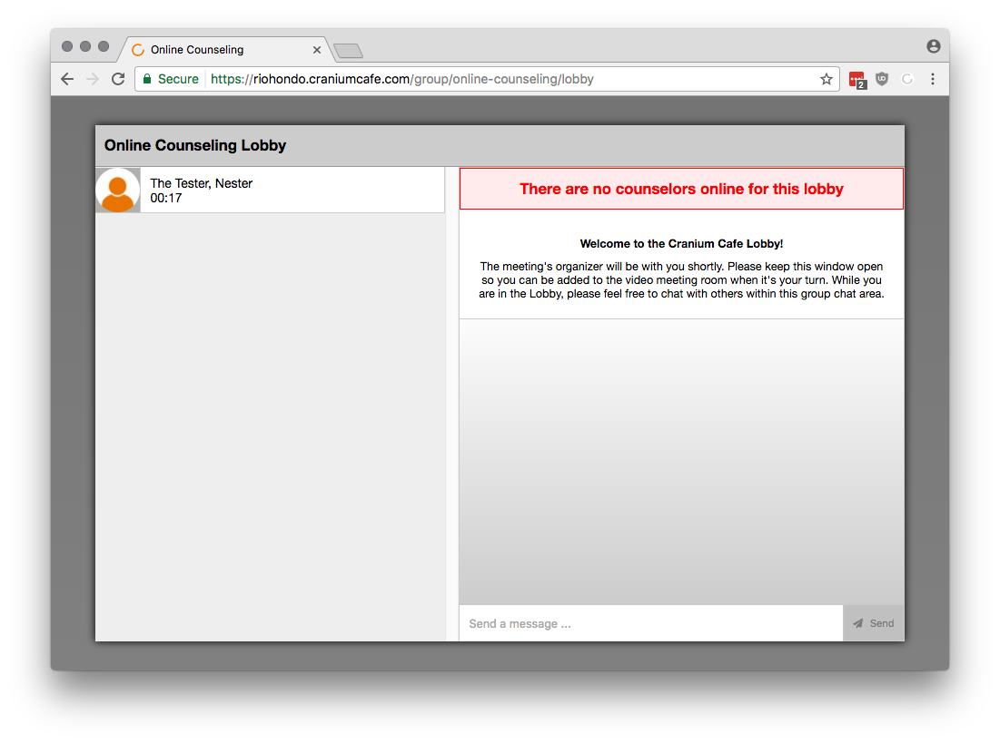

# Cranium Cafe and SARS Anywhere Integration Walkthrough

## Adding DROP-INS from My Cafe

An online counselor can have Express appointments (aka DROP-INS) that are during scheduled hours. DROP-IN appointments will be recorded to SARS Anywhere in the DROP-INS tab. Counselors can add Reason Codes and notes directly from their My Cafe.

Counselors must login to their Cafe by going to the [Rio Hondo Cranium Cafe](riohondo.craniumcafe.com) URL and then selecting Enter My Cafe.

    https://riohondo.craniumcafe.com/

Students who would like an Express appointment will need to visit the [Online Counseling lobby](https://riohondo.craniumcafe.com/group/online-counseling/lobby) URL and sign-in using the Auto Login button.

    https://riohondo.craniumcafe.com/group/online-counseling/lobby

Faculty will hear a doorbell chime and they will see students waiting in the Online Counseling lobby.

Students will see a message in Red text if there are no counselors available

