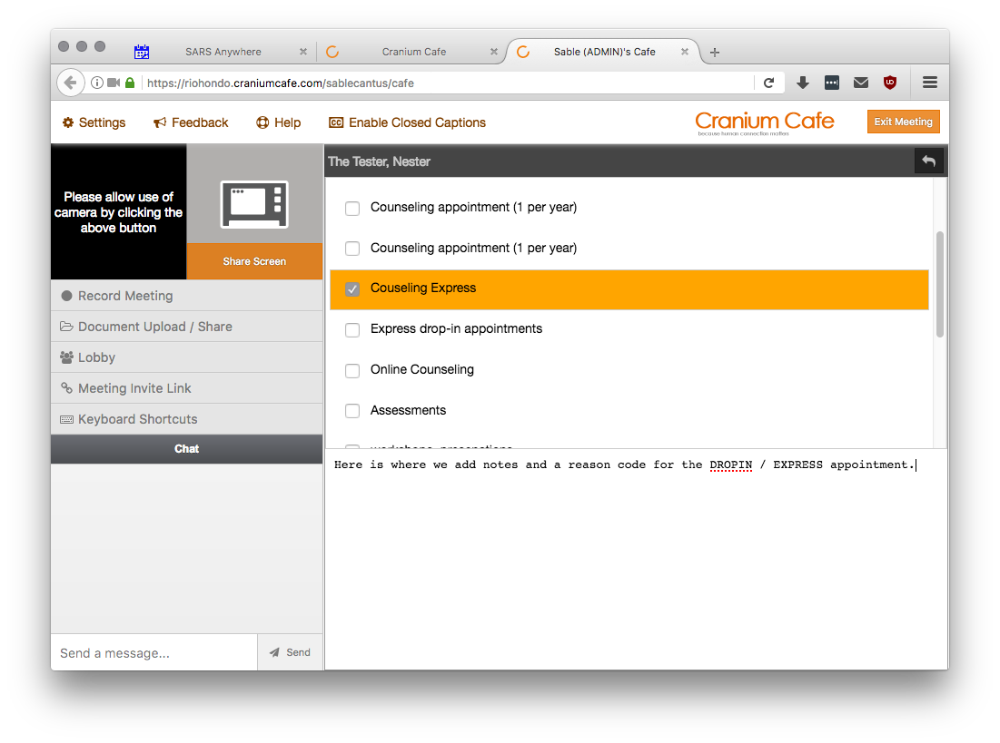

# Cranium Cafe and SARS Anywhere Integration Walkthrough

## Adding DROP-INS from My Cafe

An online counselor can have Express appointments (aka DROP-INS) that are during scheduled hours. DROP-IN appointments will be recorded to SARS Anywhere in the DROP-INS tab. Counselors can add Reason Codes and notes directly from their My Cafe.

Counselors must login to their Cafe by going to the [Rio Hondo Cranium Cafe](riohondo.craniumcafe.com) URL and then selecting Enter My Cafe.

    https://riohondo.craniumcafe.com/

Students who would like an Express appointment will need to visit the [Online Counseling lobby](https://riohondo.craniumcafe.com/group/online-counseling/lobby) URL and sign-in using the Auto Login button.

    https://riohondo.craniumcafe.com/group/online-counseling/lobby

They will sign-in with their Access Rio credentials. These are the same as they use to access Canvas.

Students may see a list of available Reason Codes to choose from for their meeting. This may change in the future to default to "EXPRESS" pending a future update (2017-03-08).

Faculty will hear a doorbell chime and they will see students waiting in the Online Counseling lobby. Select the Plus sign to add the waiting student to your meeting.

Select the "add notes and reason codes" button to update the appointment information.

The student will be added to the Drop-In screen shortly after exiting the meeting. All students seen this way will be added at that time.

